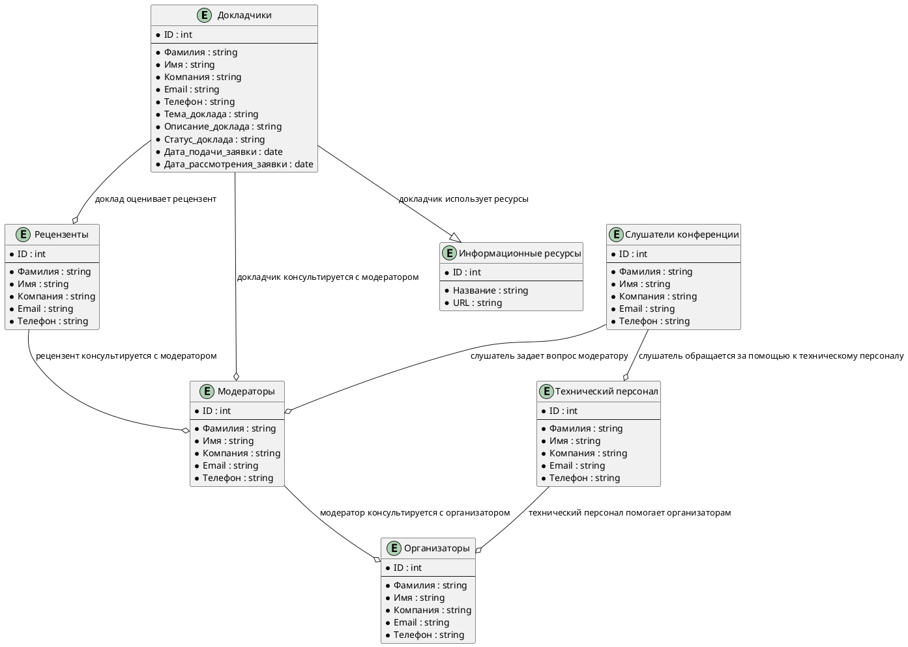
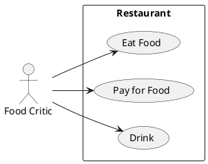

# Описание требований и архитектуры

## Введение
<!-- Общее краткое описание создаваемой системы -->
В рамках курса осуществляется проектирование решения на основе [постановки задачи от "заказчика"](../../task.md).

- [Описание требований и архитектуры](#описание-требований-и-архитектуры)
  - [Введение](#введение)
  - [Заинтересованные стороны](#заинтересованные-стороны)
  - [Бизнес-контекст (бизнес-требования)](#бизнес-контекст-бизнес-требования)
- [Бизнес-требования](#бизнес-требования)
- [Бизнес-метрики](#бизнес-метрики)
  - [Глоссарий](#глоссарий)
  - [Модель предметной области](#модель-предметной-области)
  - [Требования к системе](#требования-к-системе)
    - [Сценарии использования (Use case)](#сценарии-использования-use-case)
    - [Функциональные требования](#функциональные-требования)
    - [Нефункциональные требования/Требования к атрибутам качества](#нефункциональные-требованиятребования-к-атрибутам-качества)
    - [Ограничения](#ограничения)
  - [Архитектура](#архитектура)
    - [Журнал архитектурных решений](#журнал-архитектурных-решений)
    - [Контекст решения](#контекст-решения)
    - [Компонентная архитектура](#компонентная-архитектура)
    - [Реализация сценариев использования](#реализация-сценариев-использования)
    - [Программные интерфейсы](#программные-интерфейсы)
    - [Схема развертывания](#схема-развертывания)
  
## Заинтересованные стороны
<!-- Перечень заинтересованных сторон и их интересов по отношению к создаваемой системе. 
Подробнее: https://confluence.mts.ru/pages/viewpage.action?pageId=399975538 
-->
| Заинтересованная сторона | Интересы           |
|:-------------------------|:-------------------|
| Организаторы конференции | Содержание, формат и бюджет конференции |
| Докладчики               | Представление своего доклада        |
| Слушатели конференции| Содержание конференции|
| Технический персонал| Обеспечение технической поддержки|
| Спонсоры| Финансирование и заинтересованность в результате конференции|


## Бизнес-контекст (бизнес-требования)
<!-- Общее описание бизнес-контекста создаваемой системы (автоматизируемой деятельности), список бизнес-целей заинтересованных сторон 
Подробнее: https://confluence.mts.ru/pages/viewpage.action?pageId=399973845
-->
# Бизнес-требования
**1) Работа с участниками конференции:**
*Заинтересованные стороны Докладчики, Слушатели, Организаторы*
- Система должна позволять подавать свои заявки на участие в конференции, включая информацию о теме доклада, аннотации, резюме и контактные данные.
- Система должна обеспечивать процесс отбора заявок на участие в конференции.
- Система должна быть доступна для использования в любое время.
- Система должна предоставлять Докладчикам информацию о том, какие заявки были отобраны для участия в конференции.
- Система должна обеспечивать защиту персональных данных участников конференции, а также обеспечивать безопасность и надежность хранения и обработки данных.
**2) Работа с расписанием :**
*Заинтересованные стороны Докладчики, Слушатели, Организаторы*
- Система должна предоставлять возможность создания расписания конференции.
- Система должна позволять организаторам конференции изменять расписание в любое время и обеспечивать быстрое обновление информации и информирование для участников конференции.
**3) Проведение конференции:**
*Заинтересованные стороны Докладчики, Слушатели, Организаторы, Технический персонал, Спонсоры*
- Система должна обеспечивать бесперебойную трансляцию конференции онлайн для удаленных участников.
- Система должна позволять участникам конференции оценивать доклады и давать обратную связь организаторам.
- Система должна предоставлять Организаторам конференции информацию о количестве участников, их профилях и другой статистической информации, которая может быть полезна для оценки успеха конференции.
# Бизнес-метрики


## Глоссарий
<!-- Содержит основные понятия и термины предметной области  
Подробнее: https://confluence.mts.ru/pages/viewpage.action?pageId=375782595
-->
| Понятие                        | Сокращение                         | Определение                       |
|:-------------------------------|:-----------------------------------|:----------------------------------|
| *Термин, обозначающий понятие* | *Сокращение термина (при наличии)* | *Развернутое определение понятия* |

## [Модель предметной области](data/data.md)
**Состав бизнес-сущностей**
| Бизнес-сущность                        | Описание                   | 
|:-------------------------------|:-----------------------------------|
| Докладчики| Физические лица, которые подали заявку на участие в конференции и были отобраны для презентации своих докладов|
|Слушатели конференции|Физические лица, которые зарегистрировались для участия в конференции и имеют доступ к информации о конференции|
|Организаторы|Физические или юридические лица, ответственные за организацию и проведение конференции|
|Рецензенты|Физические лица, которые имеют право просматривать и оценивать заявки на участие в конференции и давать рекомендации по отбору докладов|
|Модераторы|Физические лица, которые отвечают за общение с докладчиками, сбор презентаций и контроль качества контента|
|Технический персонал|Физические лица, которые занимаются трансляцией конференции в режиме реального времени для удаленных участников, а также следать за возникновением технических проблем и исправляют их|
|Информационные ресурсы|информационные каналы и площадки, которые могут быть использованы для продвижения конференции и обмена информацией между участниками|

**Модель данных**



## Требования к системе

### Сценарии использования (Use case)
<!-- Подробное описание сценариев использования системы с привязкой к ролям участников и задействованным бизнес-сущностям 
https://confluence.mts.ru/pages/viewpage.action?pageId=375782108 
https://confluence.mts.ru/pages/viewpage.action?pageId=375782119 
-->
#### Диаграмма сценариев использования (Use Case Diagram) <!-- omit in toc -->



#### Список сценариев использования <!-- omit in toc -->

| ID     | Описание                                          |
|--------|---------------------------------------------------|
| UC.001 | *[Название сценария использования](uc/uc.001.md)* |

### Функциональные требования
<!-- Описание требований к функциям, реализуемым системой. Требование может быть привязано к сценарию использования или быть общим 
Подробнее: https://confluence.mts.ru/pages/viewpage.action?pageId=375782501 
-->
| ID     | Функциональное требование             |
|--------|---------------------------------------|
|  **Блок работа с участниками конференции**                                   ||
| FR.001| Система должна предоставлять форму для подачи заявок на участие в конференции, включая возможность прикрепления файлов (например, аннотации, резюме, презентации) |
|FR.002|Система должна обеспечивать возможность оценивать заявки Организаторам, выбирать Докладчиков и составлять программу конференции|
|FR.003|Система должна предоставлять Докладчикам информацию о том, какие заявки были отобраны|
|FR.004|Система должна обеспечивать защиту персональных данных участников конференции, а также обеспечивать безопасность и надежность хранения и обработки данных|
|FR.005|Система должна быть доступна для использования в любое время, включая высокую доступность и быстрый отклик на запросы пользователей|
|**Блок работа с расписанием**||
|FR.006|Система должна предоставлять возможность Организаторам создания расписания конференции: включая информацию о времени начала и конца каждого доклада, панельной дискуссии, перерывов и других мероприятий|
|FR.007|Система должна позволять Организаторам конференции изменять расписание в любое время и обеспечивать быстрое оповещение по почте Докладчиков и Слушателей|
|**Блок проведение конференции**||
|FR.008|Система должна обеспечивать трансляцию конференции онлайн для удаленных участников|
|FR.009|Система должна позволять участникам конференции оценивать доклады и давать обратную связь организаторам|
|FR.010|Система должна предоставлять организаторам конференции информацию о количестве участников, их профилях и другой статистической информации, которая может быть полезна для оценки успеха конференции|
|FR.011|Система должна быть интегрирована с другими системами, которые могут использоваться для проведения конференции, включая системы управления|


### Нефункциональные требования/Требования к атрибутам качества
<!-- Требования к основным архитектурным характеристикам (атрибутам качества) системы - надежность, масштабируемость, ИБ, и др.
Подробнее: https://confluence.mts.ru/pages/viewpage.action?pageId=375782530
-->
| ID     | Атрибут качества             | Описание требования                       |
|--------|------------------------------|-------------------------------------------|
| QR.001 | *Название атрибута качества* | *Описание требования к атрибуту качества* |

### Ограничения
<!-- Описываются ограничения, оказывающие влияние на архитектуру системы - временные, финансовые, технологические
Подробнее: https://confluence.mts.ru/pages/viewpage.action?pageId=375782592
-->
| ID     | Ограничение            |
|--------|------------------------|
| AC.001 | *Описание ограничения* |

## Архитектура

### Журнал архитектурных решений
<!-- Записи о ключевых принятых архитектурных решениях (ADR) для реализации архитектурно-значимых требований.
Подробнее: https://confluence.mts.ru/pages/viewpage.action?pageId=421162308
-->
- [ADR.NNN Суть решения](adr/adr-template.md)

### [Контекст решения](context/context.md)
```plantuml
@startuml C5_Elements
title Контекстная диаграмма программной системы
!include https://raw.githubusercontent.com/plantuml-stdlib/C4-PlantUML/master/C4_Container.puml

Person(organizer, "Организатор", "Организатор конференции") 
Person(customer, "Слушатель конференции")
Person(user, "Докладчик")
Person(sponsor, "Спонсор", "Организация, финансирующая конференцию")
System_Boundary(conference, "helloconf.mts.ru"){
    Container(reviewer, "Рецензирование докладов", "Включает функциональность для оценки докладов, принятия решений и выбора докладов для конференции") 
    Container(schedule, "Работа с расписанием", " Включает функциональность для планирования докладов, управления временем и составлении программы конференции") 
    Person(technical_staff, "Технический персонал", "Технический персонал для проведения конференции")
    Container(broadcast, "Трансляция конференции", "Включает функциональность для записи и трансляции докладов в режиме реального времени") 
    Container(feedback, "Сбор обратной связи", "Включает функциональность для оценки и комментирования докладов") 
    Container(workflow, "Работа с докладчиками", "Включает функциональность для подачи докладов, обратной связи с докладчиками и управления докладами")
    

    organizer -> conference: Управление
    workflow -> reviewer: Подача докладов
    workflow -> schedule: Подача докладов
    schedule --> broadcast: Синхронизация
    broadcast --> feedback: Синхронизация
    technical_staff --> broadcast: Подготовка
    technical_staff -> conference: Техническое обеспечение 
    customer -> broadcast: Просмотр
    user -> workflow: Использование
    user -> broadcast: Выступление
    sponsor --> conference: Финансирование
}
@enduml
```

### [Компонентная архитектура](components/components.md)


### Реализация сценариев использования
<!-- Реализация сценариев использования на основе взаимодействия компонентов системы и внешних систем/участников.
Диаграммы последовательности (UML Sequence diagram) и текстовое описание.

Подробнее: 
https://confluence.mts.ru/pages/viewpage.action?pageId=399442132
https://confluence.mts.ru/pages/viewpage.action?pageId=399442170
-->
| ID     | Описание                          | Реализация                                    |
|--------|-----------------------------------|-----------------------------------------------|
| UC.001 | *Название сценария использования* | [Реализация сценария](uc-impl/uc.001-impl.md) |

### Программные интерфейсы
<!-- Спецификации публичных API системы и ее компонентов (синхронных, событийных). Создается на основе модели предметной области для реализации сценариев использования. 
  Форматы: OAS/Swagger, GraphQL, AsyncAPI/CloudEvents
-->
| Компонент             | Интерфейс                                      |
|:----------------------|:-----------------------------------------------|
| *Название компонента* | *[Название интерфейса](api/service-name.yaml)* |

### [Схема развертывания](deployment/deployment.md)
